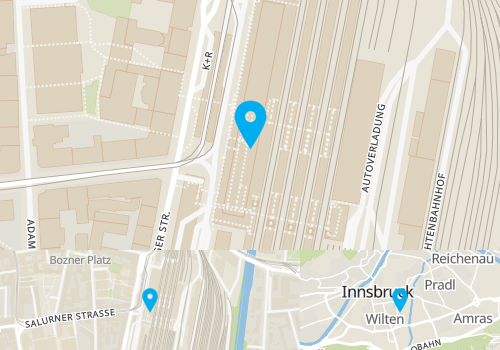

# SwiftTileserverCache

## Installing

- Install Docker
- Crate a new folder to store the yml file in and change into it: `mkdir TileServer && cd TileServer`
- Load the yml: `wget https://raw.githubusercontent.com/123FLO321/SwiftTileserverCache/master/docker-compose.yml`
- Edit the docker-compose.yml file if you want to change defaults. Default will work fine.
- Crate a new folder to store TileServer data in and chagne into it: `mkdir TileServer && cd TileServer`
- Get Download command from https://openmaptiles.com/downloads/planet/ for your region.
- Download the file using wget.
- Rename file to end in .mbtiles if it got named incorrectly
- Change one layer back into the folder where the docker-compose.yml file is located: `cd ..`
- Start and attach to logs: `docker-compose up -d && docker-compose logs -f`

## Formats

- Tiles: 
    - `GET tile/{style}/{z}/{x}/{y}/{scale}/{format}`
- StaticMap: 
    - `POST /staticmap` (StaticMap Object in JSON Format as POST body)
    - `GET /staticmap` (SaticMap Object in URL Parameters. Markers and Polygons require POST)
    - `GET /staticmap/:template` (Template Enviroment parsed from URL Parameters. Parameters ending in `json` will be parsed as json. Multiple instances of same Parameter will be parsed as array)
- MutliStaticMap:
    - `POST /multistaticmap` (MultiStaticMap Object in JSON Format as POST body)
    - `GET /multistaticmap/:template` (Template Enviroment parsed from URL Parameters. Parameters ending in `json` will be parsed as json. Multiple instances of same Parameter will be parsed as array)

### Style
Get a list of styles by visiting `/styles`
Checkout https://tileserver.readthedocs.io for a guide on how to add more styles.

### StaticMap
StaticMap route accetps an StaticMap Object JSON Object as POST body:
Example:
```
{
  "style": string (check avilable styles at /styles),
  "latitude": double,
  "longitude": double,
  "zoom": int,
  "width": int,
  "height": int,
  "scale": int,
  "format": string? (png, jpg, ...),
  "bearing": double?,
  "pitch": double?,
  "markers": [Marker]?,
  "geofences": [Geofence]?
}
```

### MultiStaticMap
MultiStaticMap route accetps an MultiStaticMap JSON Object as POST Body:
Example:
```
{
    "grid": [
        {
            "direction": string (always "first"),
            "maps": [
                {
                    "direction": string (always "first"),
                    "map": StaticMap
                }, {
                    "direction": string ("right", or "bottom"),
                    "map": StaticMap
                }, 
                ...
            ]
        },
        {
            "direction": string ("right", or "bottom"),
            "maps": [
                {
                    "direction": string (always "first"),
                    "map": StaticMap
                }, {
                    "direction": string ("right", or "bottom"),
                    "map": StaticMap
                }, 
                ...
            ]
        },
        ...
    ]
}
```

### Marker
Marker JSON used in StaticMap:
Example:
```
{
  "url": string,
  "height": int,
  "width": int,
  "x_offset": int,
  "y_offset": int,
  "latitude": double,
  "longitude": double
}
```

### Geofence
Geofence JSON used in StaticMap:
Example:
```
{
  "fill_color": string (imagemagick color string),
  "stroke_color": string (imagemagick color string),
  "stroke_width": int,
  "path": [
    [double (lat), double (lon)],
    [double, double],
    ...
  ]
}
```

## Examples

### Tiles
https://tileserverurl/tile/klokantech-basic/{z}/{x}/{y}/2/png

### StaticMap
https://tileserverurl/staticmap?style=klokantech-basic&latitude=47.263416&longitude=11.400512&zoom=17&width=500&height=500&scale=2

### StaticMap with Markers
`POST https://tileserverurl/staticmap`
```JSON
{
    "style": "klokantech-basic",
    "latitude": 47.263416,
    "longitude": 11.400512,
    "zoom": 17,
    "width": 500,
    "height": 500,
    "scale": 1,
    "markers": [
        {
            "url": "https://upload.wikimedia.org/wikipedia/commons/thumb/8/88/Map_marker.svg/1200px-Map_marker.svg.png",
            "latitude": 47.263416,
            "longitude": 11.400512,
            "width": 50,
            "height": 50
        }
    ]
}
```


### MultiStaticMap
`POST https://tileserverurl/multistaticmap`
```JSON
{
    "grid": [
        {
            "direction": "first",
            "maps": [
                {
                    "direction": "first",
                    "map": {
                        "style": "klokantech-basic",
                        "latitude": 47.263416,
                        "longitude": 11.400512,
                        "zoom": 17,
                        "width": 500,
                        "height": 250,
                        "scale": 1,
                        "markers": [
                            {
                                "url": "https://upload.wikimedia.org/wikipedia/commons/thumb/8/88/Map_marker.svg/1200px-Map_marker.svg.png",
                                "latitude": 47.263416,
                                "longitude": 11.400512,
                                "width": 50,
                                "height": 50
                            }
                        ]
                    }
                }
            ]
        },
        {
            "direction": "bottom",
            "maps": [
                {
                    "direction": "first",
                    "map": {
                        "style": "klokantech-basic",
                        "latitude": 47.263416,
                        "longitude": 11.400512,
                        "zoom": 17,
                        "width": 300,
                        "height": 100,
                        "scale": 1,
                        "markers": [
                            {
                                "url": "https://upload.wikimedia.org/wikipedia/commons/thumb/8/88/Map_marker.svg/1200px-Map_marker.svg.png",
                                "latitude": 47.263416,
                                "longitude": 11.400512,
                                "width": 25,
                                "height": 25
                            }
                        ]
                    }
                },
                {
                    "direction": "right",
                    "map": {
                        "style": "klokantech-basic",
                        "latitude": 47.263416,
                        "longitude": 11.400512,
                        "zoom": 12,
                        "width": 200,
                        "height": 100,
                        "scale": 1,
                        "markers": [
                            {
                                "url": "https://upload.wikimedia.org/wikipedia/commons/thumb/8/88/Map_marker.svg/1200px-Map_marker.svg.png",
                                "latitude": 47.263416,
                                "longitude": 11.400512,
                                "width": 25,
                                "height": 25
                            }
                        ]
                    }
                }
            ]
        }
    ]
}
```


### StaticMap using Templates
`pokemon.json` file in `Templates` directory (uses [Stencil](https://stencil.fuller.li) as TemplatingEngine):
```
{
    "style": "klokantech-basic",
    "latitude": {{lat}},
    "longitude": {{lon}},
    "zoom": 15,
    "width": 500,
    "height": 250,
    "scale": 1,
    "markers": [
        {
            "url": "https://rdmurl/static/img/pokemon/{{id}}-{{form}}.png",
            "latitude": {{lat}},
            "longitude": {{lon}},
            "width": 50,
            "height": 50
        }
    ]
}
```
`GET https://tileserverurl/staticmap/pokemon?id=201&lat=47.263416&lon=11.400512&form=5`

